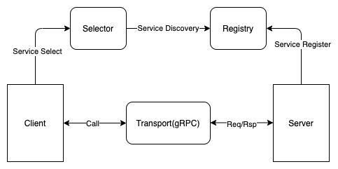

# micro

Simple microservice framework for golang. 

Only provides features as: RPC Client/Server, Service Discovery.

RPC trasport is based on gRPC.

### References

* [go-micro v2](https://github.com/asim/go-micro)
* [nano](https://github.com/lonng/nano)


### Design



## Issues

### etcd v3 conflict with grpc
https://www.cnblogs.com/FG123/p/13618503.html


## Run Examples

```
docker-compose -f docker-compose-example.yml up
```